If you'd like to list new community components, please make a PR to [this doc](https://github.com/pmndrs/react-three-fiber/tree/master/docs/getting-started/community-r3f-components.mdx) file.

## Repos and docs

### Data sources

 - [NASA-AMMOS/3DTilesRendererJS](https://github.com/NASA-AMMOS/3DTilesRendererJS/) (r3f [readme](https://github.com/NASA-AMMOS/3DTilesRendererJS/blob/master/src/r3f/README.md)) to render OGC 3D Tiles (+ 2D & 3D tiled content) in threejs
 - [SparkJS R3F](https://github.com/sparkjsdev/spark-react-r3f) for 3DGS rendering, animation etc

### Renderers & frameworks

 - Takram three-geospatial [clouds doc](https://github.com/takram-design-engineering/three-geospatial/tree/main/packages/clouds) and [demos](https://takram-design-engineering.github.io/three-geospatial/?path=/story/clouds-3d-tiles-renderer-integration--tokyo), and [atmosphere doc](https://github.com/takram-design-engineering/three-geospatial/tree/main/packages/atmosphere)
 - [threepipe plugin-r3f](https://threepipe.org/package/plugin-r3f.html#importing-and-setup) leveraging ThreePipe's powerful viewer context and plugin system
 - [RodrigoHamuy/react-three-map](https://github.com/RodrigoHamuy/react-three-map) to bridge R3F on top of Maplibre/Mapbox react-map-gl
 - [14islands/r3f-scroll-rig](https://github.com/14islands/r3f-scroll-rig) and [doc](https://tympanus.net/codrops/2023/10/10/progressively-enhanced-webgl-lens-refraction/) for syncing 3D meshes and DOM elements
 - [Theatre-js](https://github.com/theatre-js/theatre) repo and [doc](https://www.theatrejs.com/docs/latest) animation and keyframing

### Materials and VFX

 - [FarazzShaikh/CustomShaderMaterial](https://github.com/FarazzShaikh/THREE-CustomShaderMaterial)
 - [pmndrs/THREE.MeshLine](https://github.com/pmndrs/meshline)
 - [wass08/wawa-vfx](https://github.com/wass08/wawa-vfx)
 - [mustache-dev/Three-VFX](https://github.com/mustache-dev/Three-VFX)
 - [ektogamat/R3F-Ultimate-Lens-Flare](https://github.com/ektogamat/R3F-Ultimate-Lens-Flare)
 - [troika-three-text](https://github.com/protectwise/troika/tree/main/packages/troika-three-text)

### Utilities

 - [utsuboco/r3f-perf](https://github.com/utsuboco/r3f-perf)
 - [vasturiano/r3f-globe](https://github.com/vasturiano/r3f-globe) 
 
## Demos and Codesandboxes

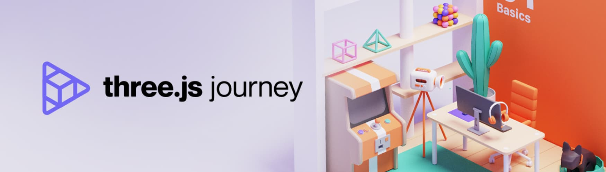
[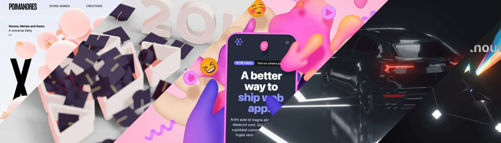](/getting-started/examples)

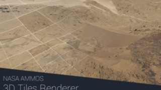

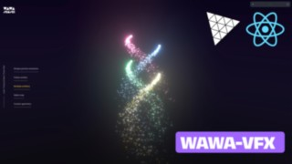

<Grid cols={3}>
  <li>
    [NASA-AMMOS/3DTilesRendererJS](https://github.com/NASA-AMMOS/3DTilesRendererJS)

    
  </li>

  <li>
    [Takram three-geospatial clouds](https://github.com/takram-design-engineering/three-geospatial/tree/main/packages/clouds)

    
  </li>

  <li>
    [sparkjsdev/spark-react-r3f](https://github.com/sparkjsdev/spark-react-r3f) 3DGS

    
  </li>

  <li>
    [threepipe plugin-r3f](https://threepipe.org/package/plugin-r3f.html#importing-and-setup)

    [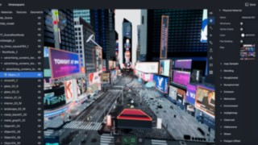](https://threepipe.org/examples/tweakpane-editor/)
  </li>

  <li>
    [react-three-map](https://github.com/RodrigoHamuy/react-three-map)

    [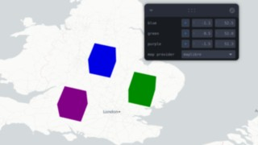](https://rodrigohamuy.github.io/react-three-map/?story=buildings-3d--default&theme=dark)
  </li>

  <li>
    [Farazz/CustomShaderMaterial](https://github.com/FarazzShaikh/THREE-CustomShaderMaterial)

    [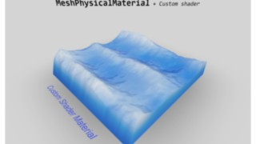](https://farazzshaikh.github.io/THREE-CustomShaderMaterial/#/caustics)
  </li>

  <li>
    [wass08/wawa-vfx](https://github.com/wass08/wawa-vfx)

    
  </li>

  <li>
    [mustache-dev/Three-VFX](https://github.com/mustache-dev/Three-VFX)

    [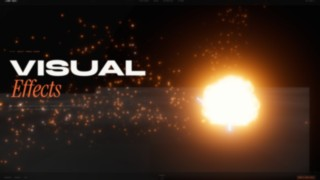](https://three-vfx.vercel.app/)
  </li>

  <li>
    [14islands/r3f-scroll-rig](https://github.com/14islands/r3f-scroll-rig)

    [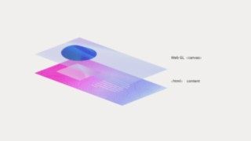](https://codesandbox.io/p/sandbox/fu0ky6)

    
  </li>
   
  <li>
    [utsuboco/r3f-perf](https://github.com/utsuboco/r3f-perf)
    <Codesandbox id="ykfpwf" />
  </li>

  <li>
    [Takram three-geospatial atmosphere](https://github.com/takram-design-engineering/three-geospatial/tree/main/packages/atmosphere)

    [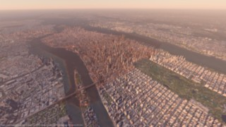](https://takram-design-engineering.github.io/three-geospatial/?path=/story/atmosphere-3d-tiles-renderer-integration--manhattan)
  </li>

  <li>
    [vasturiano/r3f-globe](https://github.com/vasturiano/r3f-globe)

    [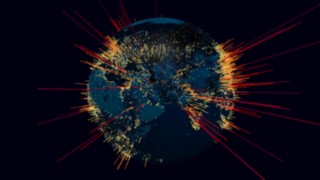](https://vasturiano.github.io/r3f-globe/example/multiple-globes/)
  </li>

  <li>
    [pmndrs/THREE.MeshLine](https://github.com/pmndrs/meshline)
    <Codesandbox id="vl221" />
  </li>

  <li>
    [ektogamat/R3F-Ultimate-Lens-Flare](https://github.com/ektogamat/R3F-Ultimate-Lens-Flare)

    [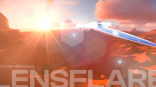](https://ultimate-lens-flare.vercel.app/)
  </li>

  <li>
    [Stale] [Theatre-js](https://github.com/theatre-js/theatre)
    <Codesandbox id="6xfrsv" screenshot_url="https://www.theatrejs.com/images/docs/0.5/manual/studio/ui.png" />
  </li>

  <li>
    [Stale] [Luma Gaussian Splats](https://cdn-luma.com/public/lumalabs.ai/luma-web-library/0.2/fefe154/index.html#react-three-fiber)
    <Codesandbox id="h2fkgq" />
  </li>

  <li>
    [Stale] [NYTimes/three-loader-3dtiles](https://github.com/nytimes/three-loader-3dtiles/blob/dev/examples/r3f/src/index.tsx)

    [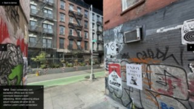](https://nytimes.github.io/three-loader-3dtiles/dist/web/examples/demos/realitycapture/)
  </li>

  <li>
    [Stale] [Looking Glass](https://docs.lookingglassfactory.com/developer-tools/webxr/react-three-fiber)
    <Codesandbox id="xzlmzz" screenshot_url="https://blog.lookingglassfactory.com/content/images/size/w2000/2024/05/LKG-32-Spatial-Display-Portrait-Cleopatra-1.jpg"/> 
  </li>

</Grid>