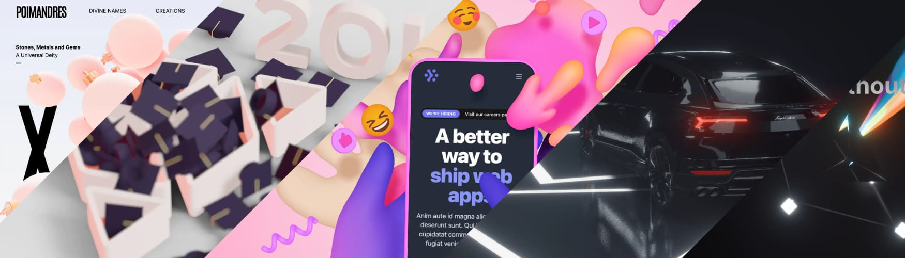
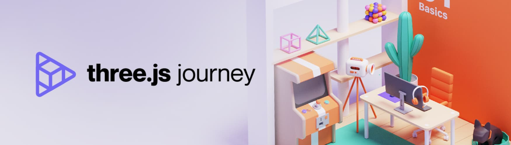

<Intro>
  Build your scene declaratively with re-usable, self-contained components that react to state, are readily interactive and can participate in [React](https://react.dev)'s ecosystem.
</Intro>

[](/getting-started/examples)

```bash
npm install three @types/three @react-three/fiber
```
> [!WARNING]  
> Three-fiber is a React renderer, it must pair with a major version of React, just like react-dom, react-native, etc. @react-three/fiber@8 pairs with react@18, @react-three/fiber@9 pairs with react@19.

## Does it have limitations?

None. Everything that works in Threejs will work here without exception.

## Is it slower than plain Threejs?

No. There is no overhead. Components render outside of React. It outperforms Threejs in scale due to React's scheduling abilities.

## Can it keep up with frequent feature updates to Threejs?

Yes. It merely expresses Threejs in JSX, `<mesh />` dynamically turns into `new THREE.Mesh()`. If a new Threejs version adds, removes or changes features, it will be available to you instantly without depending on updates to this library.

## What does it look like?

Let's make a re-usable component that has its own state, reacts to user-input and participates in the render-loop:

<Sandpack
  customSetup={{
    dependencies: {
      'react': 'latest',
      'react-dom': 'latest',
      'three': 'latest',
      '@react-three/fiber': 'latest'
    },
    entry: '/index.jsx',
  }}
  folder="basic-example-sandpack"
/>

<details>
  <summary>Show TypeScript example</summary>

```bash
npm install @types/three
```

<Sandpack
  customSetup={{
    dependencies: {
      'react': 'latest',
      'react-dom': 'latest',
      'three': 'latest',
      '@types/three': 'latest',
      '@react-three/fiber': 'latest'
    },
    entry: '/index.tsx',
    main: '/index.tsx',
  }}
  files={{
    '/styles.css': `html,body,#root {height:100%;margin:unset;}`,
    '/index.tsx': `import * as THREE from 'three'
import { createRoot } from 'react-dom/client'
import React, { useRef, useState } from 'react'
import { Canvas, useFrame, ThreeElements } from '@react-three/fiber'
import './styles.css'

function Box(props: ThreeElements['mesh']) {
  const meshRef = useRef<THREE.Mesh>(null!)
  const [hovered, setHover] = useState(false)
  const [active, setActive] = useState(false)
  useFrame((state, delta) => (meshRef.current.rotation.x += delta))
  return (
    <mesh
      {...props}
      ref={meshRef}
      scale={active ? 1.5 : 1}
      onClick={(event) => setActive(!active)}
      onPointerOver={(event) => setHover(true)}
      onPointerOut={(event) => setHover(false)}>
      <boxGeometry args={[1, 1, 1]} />
      <meshStandardMaterial color={hovered ? 'hotpink' : '#2f74c0'} />
    </mesh>
  )
}

createRoot(document.getElementById('root')).render(
  <Canvas>
    <ambientLight intensity={Math.PI / 2} />
    <spotLight position={[10, 10, 10]} angle={0.15} penumbra={1} decay={0} intensity={Math.PI} />
    <pointLight position={[-10, -10, -10]} decay={0} intensity={Math.PI} />
    <Box position={[-1.2, 0, 0]} />
    <Box position={[1.2, 0, 0]} />
  </Canvas>,
)`,
  }}
/>

</details>

<details>
  <summary>Show React Native example</summary>

For installation instructions see [react native installation instructions](/getting-started/installation#react-native).

```jsx
import React, { useRef, useState } from 'react'
import { Canvas, useFrame } from '@react-three/fiber/native'

function Box(props) {
  const meshRef = useRef(null)
  const [hovered, setHover] = useState(false)
  const [active, setActive] = useState(false)
  useFrame((state, delta) => (meshRef.current.rotation.x += delta))
  return (
    <mesh
      {...props}
      ref={meshRef}
      scale={active ? 1.5 : 1}
      onClick={(event) => setActive(!active)}
      onPointerOver={(event) => setHover(true)}
      onPointerOut={(event) => setHover(false)}>
      <boxGeometry args={[1, 1, 1]} />
      <meshStandardMaterial color={hovered ? 'hotpink' : 'orange'} />
    </mesh>
  )
}

export default function App() {
  return (
    <Canvas>
      <ambientLight intensity={Math.PI / 2} />
      <spotLight position={[10, 10, 10]} angle={0.15} penumbra={1} decay={0} intensity={Math.PI} />
      <pointLight position={[-10, -10, -10]} decay={0} intensity={Math.PI} />
      <Box position={[-1.2, 0, 0]} />
      <Box position={[1.2, 0, 0]} />
    </Canvas>
  )
}
```

</details>

## First steps

You need to be versed in both React and Threejs before rushing into this. If you are unsure about React consult the official [React docs](https://react.dev/learn), especially [the section about hooks](https://react.dev/reference/react). As for Threejs, make sure you at least glance over the following links:

1. Make sure you have a [basic grasp of Threejs](https://threejs.org/docs/index.html#manual/en/introduction/Creating-a-scene). Keep that site open.
2. When you know what a scene is, a camera, mesh, geometry, material, fork the [demo above](https://github.com/pmndrs/react-three-fiber#what-does-it-look-like).
3. [Look up](https://threejs.org/docs/index.html#api/en/objects/Mesh) the JSX elements that you see (mesh, ambientLight, etc), _all_ threejs exports are native to three-fiber.
4. Try changing some values, scroll through our [API](/api/canvas) to see what the various settings and hooks do.

Some helpful material:

- [Threejs-docs](https://threejs.org/docs) and [examples](https://threejs.org/examples)
- [Discover Threejs](https://discoverthreejs.com), especially the [Tips and Tricks](https://discoverthreejs.com/tips-and-tricks) chapter for best practices
- [Bruno Simons Threejs Journey](https://threejs-journey.com), arguably the best learning resource, now includes a full [R3F chapter](https://threejs-journey.com/lessons/what-are-react-and-react-three-fiber)

<a href="https://threejs-journey.com">
  
</a>

## Eco system

There is a vibrant and extensive eco system around three-fiber, full of libraries, helpers and abstractions.

- [`@react-three/drei`](https://github.com/pmndrs/drei) &ndash; useful helpers, this is an eco system in itself
- [`@react-three/gltfjsx`](https://github.com/pmndrs/gltfjsx) &ndash; turns GLTFs into JSX components
- [`@react-three/postprocessing`](https://github.com/pmndrs/react-postprocessing) &ndash; post-processing effects
- [`@react-three/test-renderer`](https://github.com/pmndrs/react-three-fiber/tree/master/packages/test-renderer) &ndash; for unit tests in node
- [`@react-three/flex`](https://github.com/pmndrs/react-three-flex) &ndash; flexbox for react-three-fiber
- [`@react-three/xr`](https://github.com/pmndrs/react-xr) &ndash; VR/AR controllers and events
- [`@react-three/csg`](https://github.com/pmndrs/react-three-csg) &ndash; constructive solid geometry
- [`@react-three/rapier`](https://github.com/pmndrs/react-three-rapier) &ndash; 3D physics using Rapier
- [`@react-three/cannon`](https://github.com/pmndrs/use-cannon) &ndash; 3D physics using Cannon
- [`@react-three/p2`](https://github.com/pmndrs/use-p2) &ndash; 2D physics using P2
- [`@react-three/a11y`](https://github.com/pmndrs/react-three-a11y) &ndash; real a11y for your scene
- [`@react-three/gpu-pathtracer`](https://github.com/pmndrs/react-three-gpu-pathtracer) &ndash; realistic path tracing
- [`create-r3f-app next`](https://github.com/pmndrs/react-three-next) &ndash; nextjs starter
- [`lamina`](https://github.com/pmndrs/lamina) &ndash; layer based shader materials
- [`zustand`](https://github.com/pmndrs/zustand) &ndash; flux based state management
- [`jotai`](https://github.com/pmndrs/jotai) &ndash; atoms based state management
- [`valtio`](https://github.com/pmndrs/valtio) &ndash; proxy based state management
- [`react-spring`](https://github.com/pmndrs/react-spring) &ndash; a spring-physics-based animation library
- [`framer-motion-3d`](https://www.framer.com/docs/three-introduction/) &ndash; framer motion, a popular animation library
- [`use-gesture`](https://github.com/pmndrs/react-use-gesture) &ndash; mouse/touch gestures
- [`leva`](https://github.com/pmndrs/leva) &ndash; create GUI controls in seconds
- [`maath`](https://github.com/pmndrs/maath) &ndash; a kitchen sink for math helpers
- [`miniplex`](https://github.com/hmans/miniplex) &ndash; ECS (entity management system)
- [`composer-suite`](https://github.com/hmans/composer-suite) &ndash; composing shaders, particles, effects and game mechanics

## How to contribute

If you like this project, please consider helping out. All contributions are welcome as well as donations to [Opencollective](https://opencollective.com/react-three-fiber), or in crypto `BTC: 36fuguTPxGCNnYZSRdgdh6Ea94brCAjMbH`, `ETH: 0x6E3f79Ea1d0dcedeb33D3fC6c34d2B1f156F2682`.

## Backers

Thank you to all our backers! 🙏

<a href="https://opencollective.com/react-three-fiber#backers" target="_blank">
  
</a>

## Contributors

This project exists thanks to all the people who contribute.

<a href="https://github.com/pmndrs/react-three-fiber/graphs/contributors">
  
</a>
