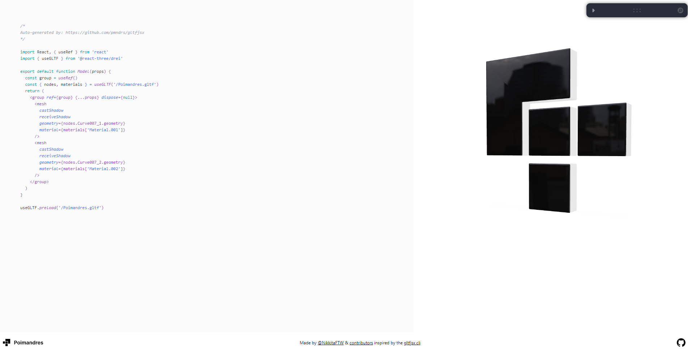

> All the models in this page were created by Sara Vieira and are freely available to download from any of the sandboxes.

There are many types of 3D model extensions, in this page we will focus on loading the three most common ones: `GLTF`, `FBX` and `OBJ`. All of these will use the `useLoader` function but in slightly different ways.

This whole section will assume you have placed your models in the public folder or in a place in your application where you can import them easily.

## Loading GLTF models

Starting with the open standard and the one that has more support in React Three Fiber we will load a `.gltf` model.

Let's start by importing the two things we need:

```js
import { useLoader } from '@react-three/fiber'
import { GLTFLoader } from 'three/addons/loaders/GLTFLoader.js'
```

With this we can create a Model component and place it in our scene like so:

```jsx
function Scene() {
  const gltf = useLoader(GLTFLoader, '/Poimandres.gltf')
  return <primitive object={gltf.scene} />
}
```

You can play with the sandbox and see how it looks here after I added an HDRI background:

<Codesandbox id="6etx1" />

### Loading GLTF models as JSX Components

Here comes the really fancy part, you can transform these models into React components and then use them as you would any React component.

To do this, grab your `GLTF` model and head over to [https://gltf.pmnd.rs/](https://gltf.pmnd.rs/) and drop your `GLTF`, after that you should see something like:



Let's now copy the code and move it over to `Model.js`:

```jsx
/*
Auto-generated by: https://github.com/pmndrs/gltfjsx
*/

import React, { useRef } from 'react'
import { useGLTF } from '@react-three/drei'

export default function Model(props) {
  const groupRef = useRef()
  const { nodes, materials } = useGLTF('/Poimandres.gltf')
  return (
    <group ref={groupRef} {...props} dispose={null}>
      <mesh castShadow receiveShadow geometry={nodes.Curve007_1.geometry} material={materials['Material.001']} />
      <mesh castShadow receiveShadow geometry={nodes.Curve007_2.geometry} material={materials['Material.002']} />
    </group>
  )
}

useGLTF.preload('/Poimandres.gltf')
```

Now we can import our model like we would import any React component and use it in our app:

```jsx
import { Suspense } from 'react'
import { Canvas } from '@react-three/fiber'
import { Environment } from '@react-three/drei'

import Model from './Model'

export default function App() {
  return (
    <div className="App">
      <Canvas>
        <Suspense fallback={null}>
          <Model />
          <Environment preset="sunset" background />
        </Suspense>
      </Canvas>
    </div>
  )
}
```

You can play with the sandbox here:

<Codesandbox id="vbnbf" />

## Loading OBJ models

In this case, we will use the trusted `useLoader` hook but in combination with `three.js` `OBJLoader`.

```js
import { OBJLoader } from 'three/addons/loaders/OBJLoader.js'
import { useLoader } from '@react-three/fiber'
```

With these imported let's get the mesh into our scene:

```jsx
function Scene() {
  const obj = useLoader(OBJLoader, '/Poimandres.obj')
  return <primitive object={obj} />
}
```

And here we go, we have an OBJ model showing on the web! Pretty cool ah?

You can play with the sandbox here:

<Codesandbox id="51zks" />

## Loading FBX models

Let's again use the trusted `useLoader` but this time with the `FBXLoader` that comes from `three.js`

```js
import { useLoader } from '@react-three/fiber'
import { FBXLoader } from 'three/addons/loaders/FBXLoader.js'
```

To create our scene we can get the FBX as a return value of the useLoader by passing the `FBXloader` and the location of our file like so:

```jsx
function Scene() {
  const fbx = useLoader(FBXLoader, '/Poimandres.fbx')
  return <primitive object={fbx} />
}
```

You can play with the sandbox here:

<Codesandbox id="ssrfg" />

### Loading FBX models using `useFBX`

[@react-three/drei](https://github.com/pmndrs/drei) exports a very useful helper when it comes to loading FBX models and it's called `useFBX`, in this case there is no need to import anything from `three.js` as it is all done behind the scenes and we can just pass the location of the file to `useFBX` like so:

```jsx
function Scene() {
  const fbx = useFBX('/Poimandres.fbx')
  return <primitive object={fbx} />
}
```

You can play with the sandbox here:

<Codesandbox id="m6p73" />

## Showing a loader

If your model is big and takes a while to load, it's always good to show a small loader of how much is already is loaded and again [@react-three/drei](https://github.com/pmndrs/drei) is here to help with `Html` and `useProgress`.

- `Html` allows you place plain ol' HTML in your canvas and render it like you would a normal DOM element.
- `useProgress` is a hook that gives you a bunch of information about the loading status of your model.

With these two things, we can create a very bare-bones loading component like so:

```jsx
import { Html, useProgress } from '@react-three/drei'

function Loader() {
  const { progress } = useProgress()
  return <Html center>{progress} % loaded</Html>
}
```

We can then wrap our model in it using `Suspense` like so:

```jsx
export default function App() {
  return (
    <Canvas>
      <Suspense fallback={<Loader />}>
        <Model />
      </Suspense>
    </Canvas>
  )
}
```

The hook returns much more than just the progress so there is a lot you can do there to give the user more information about the loading status of the application. You can play with all of them in this sandbox:

<Codesandbox id="nn2m7" />
