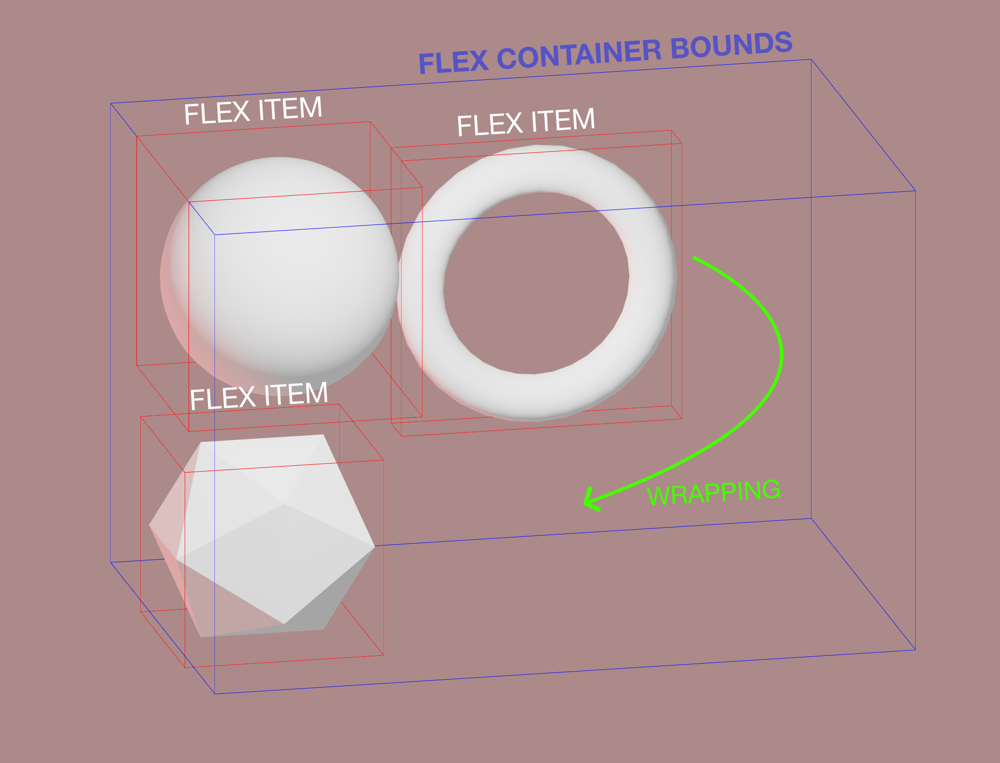
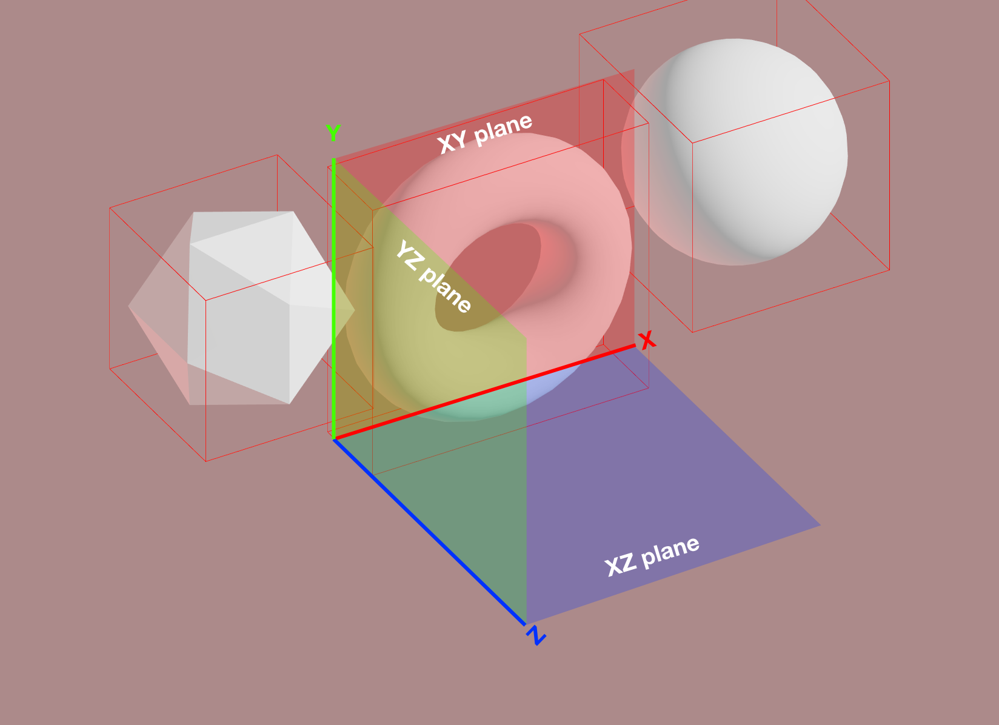
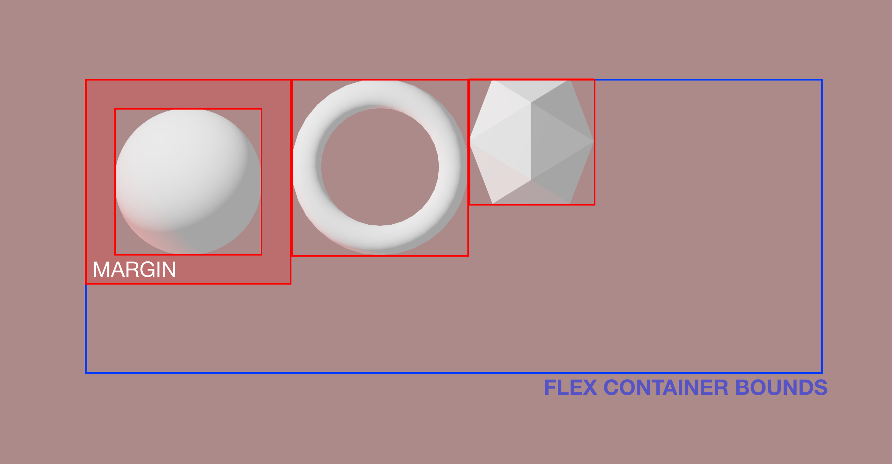

# react-three-flex

[](https://github.com/react-spring/react-three-flex/releases)
[](https://www.npmjs.com/package/react-three-flex)
[](https://www.npmjs.com/package/react-three-flex)
[](https://discord.gg/ZZjjNvJ)

Placing content in THREE.js is hard. **`react-three-flex`** brings the webs flexbox spec to [react-three-fiber](https://github.com/react-spring/react-three-fiber).
It is based on [Yoga](https://github.com/facebook/yoga), Facebook's open source layout engine for react-native.

```bash
npm install react-three-flex
```

<p align="center">
  <a href="https://codesandbox.io/embed/7psew"></a>
  <a href="https://codesandbox.io/embed/gallant-elbakyan-lvwmj"></a>
  <a href="https://codesandbox.io/embed/r3flex-jbgrq"></a>
</p>
<p align="middle">
  <i>These demos are real, you can click them! They contain the full code, too.</i>
</p>

## Table of contents

- [Usage](#usage)
  - [Anchors](#anchors)
  - [Stretching](#stretching)
  - [Invalidation and Reflow](#invalidation-and-reflow)
  - [Sizing](#sizing)
  - [Axis Orientation](#axis-orientation)
  - [Margin and Padding](#margin-and-padding)
  - [Nesting](#nesting)
  - [Measuring the Container](#measuring-the-container)
- [API](#api)
  - [Flexbox props](#flexbox-props)

## Usage

Simply create layouts by wrapping your 3D objects in different `<Box />` instances inside a `<Flex />` container. This way they will be automatically placed in the 3D space following the flexbox specification just like in the DOM.

```jsx
import { Flex, Box } from 'react-three-flex'

const Layout = () => (
  <Flex justifyContent="center" alignItems="center">
    <Box centerAnchor>
      <mesh geometry={box} />
    </Box>
    <Box centerAnchor flexGrow={1}>
      <mesh geometry={torus} />
    </Box>
  </Flex>
)
```

You can tweak the container and the boxes using standard CSS flex properties, like `flexDirection` or `justifyContent` for the container and `flexGrow` for the boxes. There are also _shorthands_, like `align` and `justify`. See the props docs below for more info.

### Anchors

When positioning items, `react-three-flex` needs to know where the object anchor is: Yoga Layout expects the object position to be relative to the upper left corner, which is the same as the DOM expects.

Most THREE.js geometries, though, are positioned relative to the object center. To tell `react-three-flex` that your `<Box />` positioning is relative to the center you need to set the `centerAnchor` prop to true.

```jsx
<Box centerAnchor>
  <mesh geometry={sphere} />
</Box>
```

If you nest `<Box />` elements, though, you need to set it to false. See [Nesting](#nesting).


### Stretching

By default `react-three-flex` controls elements position only. In some cases you may want to control element sizing too. Since `react-three-flex` has no information about how the inner content size works, you need to set your content size manually. To do so `react-three-flex` provides you the container size in two ways:

- Using a **children render function**:

```jsx
<Flex>
  <Box width="auto" height="auto" flexGrow={1} centerAnchor>
    {(width, height) => <Plane args={[width, height]} />}
  </Box>
</Flex>
```

- Using a **hook**:

```jsx
function Inner() {
  const [width, height] = useFlexSize()
  return <Plane args={[width, height]} />
}

function Outer() {
  return (
    <Flex>
      <Box width="auto" height="auto" flexGrow={1} centerAnchor>
        <Inner />
```

Remember that the `useFlexSize` hook works **ONLY** if your `<Box/>` is outside the component.

### Invalidation and Reflow

While the DOM's Flexbox has full control over all the changes of the tree, `react-three-flex` runs on React, hence it has no way to know if a children size or shape has changed. For performance reasons Flex layout calculation _does not run every frame_, and it has to be triggered manually in some cases.

**What will trigger a reflow:**

- `<Flexbox/>` props changes (alignItems, size, ...)
- `<Box/>` props changes (flexGrow, margin, ...)
- `<Flexbox/>` and `<Box/>` rerenders with children differences

```jsx
function AnimatedBox() {
  // Since <Box/> is inside the component, setting the state will rerender it, thus causing a reflow.
  // ⚠️ If <Box/> were outside this component, this would NOT cause a reflow!
  const [state, setState] = useState(true)
  useInterval(() => setState((s) => !s), 1000)
  return (
    <Box centerAnchor>
      <mesh>
        <boxBufferGeometry attach="geometry" args={[state ? 10 : 30, 10, 10]} />
```

**This will NOT cause a reflow!**

```jsx
function AnimatedBox() {
  // ⚠️ Setting state does not rerender <Box/> since it's in the parent
  // ‼️ No Reflow!!
  const [state, setState] = useState(true)
  useInterval(() => setState((s) => !s), 1000)
  return (
    <mesh scale={[state ? 1 : 3, 1, 1]}>
      <boxBufferGeometry attach="geometry" />
    </mesh>
  )
}

function Layout() {
  return (
    <Flex>
      <Box centerAnchor>
        <AnimatedBox />
```

For every other case (setting size with the `useFrame` hook, performing `react-spring` animation, or `<Box/>` are not rerendered) you'll need to **manually cause a reflow**, using the `useReflow()` hook. Reflows requests are batched every frame so you can call it from hundreds of components without performance issues.

**Animation with useFrame():**

```jsx
function AnimatedBox() {
  const ref = useRef()
  const reflow = useReflow()
  useFrame(({ clock }) => {
    ref.current.scale.x = 1 + Math.sin(clock.getElapsed())
    reflow()
  })
  return (
    <Box centerAnchor>
      <mesh ref={ref}>
```

**`<Box/>` outside of component:**

```jsx
function AnimatedBox() {
  const [state, setState] = useState(true)
  useInterval(() => setState((s) => !s), 1000)
  const reflow = useReflow()
  useEffect(reflow, [state])
  return (
    <mesh ref={ref} scale={[state ? 1 : 3, 1, 1]}>
```

### Sizing

`react-three-flex` differs from DOM Flexbox in that it relies on a parent container for the root flex. It is required to specify its dimensions using `size` prop for wrapping and to be responsive.

```jsx
<Flex flexDirection="row" flexWrap="wrap" size={[300, 200, 0]}>
  {/* ... */}
</Flex>
```

**⚠️ WATCH OUT!** Yoga flexbox engine uses whole integer numbers to perform layout calculation to preserve precision - `react-three-flex` multiplies every element size and flex prop by the `scaleFactor` of the root flex container. By default it's `100`, and works well for small scenes. If you use a different scene scale, make sure to tweak it accordingly.



### Axis Orientation

Another important difference with DOM Flexbox is that you have to specify the plane of the container in 3D. The elements will be positioned in the 2D plane given by the two axes, using width and height calculated along the two axes.

The 2D flex container width and height will be calculated by looking at the `size` prop with respect of the chosen axes (`100` for `xy` and `200` for `y` in this example).

The default plane is `xy`, the other possibilites are `yz` and `xz`.

```jsx
<Flex plane="xy" size={[100, 200, 0]}>
  {/* ... */}
</Flex>
```



### Margin and Padding

For every `<Flex />` and `<Box />` component you can specify the margin and padding like in DOM elements.

```jsx
<Flex flexDirection="row" size={[300, 200, 0]} padding={30} margin={5}>
  <Box padding={5} marginTop={5} centerAnchor>
    <mesh geometry={sphere} />
  </Box>
</Flex>
```



### Nesting

Since a `<Flex />` component works the same way as a DOM one, you can easily make complex layouts by nesting flex containers.

```jsx
<Flex flexDirection="row" flexWrap="wrap" size={[50, 0, 0]}>
  <Box centerAnchor>
    <mesh geometry={sphere} />
  </Box>
  <Box flexDirection="column" flexWrap="no-wrap">
    <Box centerAnchor>
      <mesh geometry={sphere} />
    </Box>
    <Box centerAnchor>
      <mesh geometry={box} />
    </Box>
  </Box>
</Flex>
```

### Measuring the container

When building responsive layouts you might need to syncronize the size of the 3D Flex container with the DOM, for example to synchronize scroll position or to modify the height of a scroll container.
To make it easier, you can use the `onReflow` prop on the root `<Flex>` component that will be called every time the flex layout is recalculated - e.g. when any content changes.

```jsx
<Flex onReflow={(totalWidth, totalHeight) => ...}>
 {/* ... */}
</Flex>
```

## API

You can find a full list of props [here](https://github.com/react-spring/react-three-flex/blob/master/src/props.ts).

```jsx
<Flex
  size={[1, 1, 1]} // Total size of the flex container, see above
  position={[0, 0, 0]} // Default - position for the flex container in the scene
  direction="ltr" // Default - right to left or right to left
  plane="xy" // Default - plane axes, see above
  scaleFactor={100} // Default - integer scale factor, see above (Sizing)
  onReflow={fn} // Called everytime the layout is recalculated
  {...R3FlexProps} // Standard Flexbox props, described below
>
  <Box>{/* ... */}</Box>
</Flex>
```

```jsx
<Box
  centerAnchor // If the inner content position is relative to its center, see above (Anchors)
  {...R3FlexProps} // Standard Flexbox props, described below
>
  <mesh geometry={box} />
</Box>
```

Or you can pass a **function as children**:

```jsx
<Box>{(width, height) => <Model width={width} height={height} />}</Box>
```

### Flexbox props

Both `<Flex/>` and `<Box />` components share the same Flexbox props API from Yoga. The library also provides string and number inputs for convenience and shorthands.

Example:

```jsx
// Flex with padding top set to 10, alignItems to 'center', justifyContent to 'space-around' and flexWrap to 'wrap'
<Flex pt={10} align="center" justify="space-around" wrap="wrap">
  {/* ... */}
</Flex>
```
